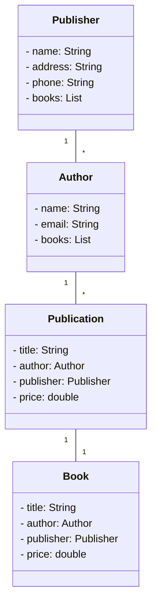

# 一、操作系统引论

## 1. 什么是操作系统，主要功能是什么

- 操作系统是最接近硬件的一层软件是用来管理计算机系统的,主要功能有: 

  - 进程管理
  - 文件管理
  - 设备管理
  - 存储管理
  - 提供人机交互接口

  ## 2. 操作系统特性

  - 共享性
  - 并发性
  - 虚拟性
  - 不确定性


# 二、进程与线程

## 1. 进程

- 进程是一个可以分配独立资源的基本单位，进程是并发活动的基本单位

- 系统由一组进程组成，操作系统进程执行系统代码，用户进程执行用户代码。

单道程序顺序执行的特征

- 封闭性
- 可再现性
- 顺序性

 多道程序并发执行

- 间断性
- 失去封闭性
- 失去再现性

**程序并发执行的条件**

- Bernstein

**进程和程序的区别:** 

- 进程是动态的，程序是静态
- 进程是并发执行的，程序是顺序执行
- 进程暂时性和程序的永久性
- 进程由程序数据和PCB组成

###  进程状态和组成

  进程有着三种基本状态: 就绪 运行 阻塞


  双挂起状态 

- 创建-就绪： 系统为用户程序创建进程，以及他需要的些数据结构，连接进程父子关系等
- 就绪-运行: 进程具备了可以运行的条件，只需要等待CPU调用进程就可以进入运行态
- 运行-退出: 进程完成了运行或者因为某些错误，系统将运行状态移除，使进程称为不可以再运行。
- 运行-阻塞: 可能因为进程暂时不能投入运行，等待某件I/0事件，或者需要某个临界资源才能运行，而该临界资源可能正在被其他进程使用，故阻塞
- 运行-就绪: 时间片结束，将进程插入到就绪队列队尾
- 运行-就绪挂起


### PCB 

  进程控制块是进程存在的唯一标识

  PCB中的内容

- 进程的描述信息
  - 进程名
  - 进程标识符
  - 用户名称
- 处理机状态信息
- 进程调度信息
- 进程控制和资源占用信息


## 2. 线程

  线程是活动运行的最基本单位,每一个线程也有自己的TCB

 ### 线程优点

- 响应速度快

- 资源共享

  一个进程内的多个线程可以共享该进程的资源

- 经济

  在创建线程或者切换线程往往比进行消耗小

### 进程线程关系

  一个进程必须要有一个或者以上的线程，该线程为主线程，主线程之间又有若干个子线程;


  线程和进程的区别

- 线程是独立调度和分配的基本单位
- 进程是资源分配的基本单位

> 将资源和调度分开，线程可以轻装运行，使得操作系统有更好的并发程度。

---


## 3. 思考问题


1. 为了支持多进程的并发执行，系统必须建立
   - 建立PCB，用于各个进程独立控制管理，pcb中记录了关于进程描述信息，如进程名称，标识符、当前状态、优先级、进程中断保存线程信息，以及只是组成进程程序和数据再存储中的位置、信息、资源信息和进程在就绪、阻塞队列中的连接关系
2. 系统提供 创建、终止、阻塞、唤醒原语、


- 系统开销 = 进程切换时间/时间片大小 = 3%


1. 打开了一个用户程序，为用户程序创建了一个进程。
2. 进程资源分配完毕，cpu调度该进程
3. 等待某个I\o时间的发生
4. 有优先级更高的进程需要被CPU调度,或者时间片到
5. CPU调用进程
6. 系统资源分配完毕，进入就绪队列等待被处理机调用

7. 该进程任务完成，或者用户程序主动退出


1. 假设A需要输出语句输出语句，B需要输入语句，若B的输出是A要输出的结构，那么这个程序就无法并发执行

2. a->b a->c

3. bernstein条件
   1. 写出各个程序段 	的R和W
   2. 判断。


# 三、进程同步和通讯

> 进程之间的协作关系有: 同步、互斥和通信
>
> - 同步： 进程之间存在某种顺序关系，某个进程需要先要执行，必须要协同动作，相互配合。
> - 互斥:  多个进程需要共享一个资源，这个资源在某个时段只能被一个进程访问
> - 通信: 进程之间需要传递一定量的消息

- 并发程序带来的问题

  全局变量在多个并发程序中，容易引发变量安全问题

  操作系统很难进行管理资源和分配资源，容易产生死锁问题

  定位程序的困难

## 1. 进程同步和互斥


### 临界区和临界资源

### 临资资源

  简单来说就是需要互斥进行访问的资源就是临界资源

### 临界区

  访问临界资源的那一份代码就是临界区

> 为了保证实现多个进程访问临界资源的安全问题，必须加以限制，否则无法并发进行执行。为了实现进程互斥，下面我们将引出解决方案。

### 互斥实现的软硬件方法

### 硬件实现

1. 禁止中断

  使用内核级别的指令关闭了中断，直到进程结束使用，才允许中中断

1. 专用机器指令

TS，swap指令


  p: 请求操作某个资源

  v: 是放某个资源

## 2. 管程

>     使用信号量可以实现进程之间的同步和互斥问题，但是需要设置很多信号量，使用大量的PV操作，如果pv之间排序不好，则会出现错误或者死锁问题。为了解决这个问题，可以使用管程操作。

  ### 思想

  就是将信号量和操作源于封装在一个对象内部，及将共享资源和针对共享资源的操作放入一个模块当中。

### 特征

1. 局限于管程的共享变量只能被管程的过程访问，任何外部过程都不能进行访问
2. 一个进程通过调用管程的一个过程进入管程。
3. 任何时候只要有一个进程在调用管程，其他所有调用管程的进程都会被挂起。


- csignal:呼唤其管程

- cwait: 等待程序

  ## 问题


1. 存在，存在互斥。因为是多个同学借一本书，书是同一本，所以是互斥资源，只有等待前者还书，后者才能借阅。
2. 存在，存在互斥。篮板球也是一不能被两队队同学使用的资源，是一种互斥资源。
3. 存在，属于同步关系，各个工序都需要等待前面工序完成
4. 存在，属于同步关系，商品不入库，就无法出库
5. 存在，属于同步关系，两者互不影响。


1. 购票者之间存在互斥关系

```
semaphore mutex = 1;
semaphore tike = 200;
void custom(){
	p(mutex);
	p(tike);
	buying
	v(mutex)
	p(tike)
}
```


---

# 四、调度与死锁

> 进程调度是多道程序运行的根本，通过进程之间切换CPU，操作系统才能提高计算机的效率。
>
> 操作系统必须为多个进程分配计算机资源。所以处理机的调度算法不仅对处理机的利用率和用户进程有影响，同时还与内存等其他资源的使用密切相关。

## 1. 调度类型与准则

### 调度类型

  关于处理机的调度类型有三种: 高级调度，中级调度，低级调度。


- 高级调度（作业调度）

- 中级调度（对换程序）

  中级调度的作用就是使得暂时无法的执行进程，进入挂起状态，提高了内存的利用率

- 低级调度（进程调度）

  是处理机的最基本调度, 决定就绪序列哪个进程获得处理机资源。

### 进程调度方式

- 不可剥夺方式

  当一个进程获得处理机资源时候，该进程将会一直执行下去，一直到运行完成或者是因为某种原因不能运行，其他进程无法在此期间占有处理机资源。

- 可剥夺方式

  允许其他某个进程抢占正在占用的处理机资源，如:优先原则。

## 2. 调度算法

>   进程调度算法是指根据系统的某种策略进行资源分配算法，对于不同系统和系统目标，通常采用不同的算法。

  调度算法有五种： 先来先服务、短作业优先、时间片轮转调度算法、优先权调度算法、多级反馈队列调度算法。

### 先来先服务

  FSCS是一种最简单的算法，采用的是进程当中就绪队列的顺序，进行资源及的分配，一般属于非剥夺式调度方式。

- 特点

  - 有利于长作业，不利于短作业

  - 有利于处理机繁忙作业，不利于I\O繁忙作业

  

### 短作业优先调度算法

- SJF

  算法目的是改进FCFS，减少作业的平均周转时间。一开始先预估作业的执行时间，对时间最短的作业优先调入内存。

- SPN算法是从就绪队列估计运行时间最短的进程，并将处理机分配它，**后来的短进程不可剥夺**。

  特点:

1. 该删了平均周转时间和平均带全周转时间，缩短了等待时间。
2. 有利于提高吞吐量


### 时间片轮状调度算法

  时间轮状算法主要用于进程调度，每次时间片结束，由系统时钟发出中断，切换进程。

> 注意考虑时间片问题取值，因为如果取的过长，进程都在一个时间片内完成，就退化称为FCFS，如果取得过于短，那么就会造成进程不断切换。


### 优先权调度算法

  为了照顾紧急进程，使得紧急的进程能够尽快被处理，很多操作系统使用了优先调度算法。

  对于优先权有两种确定方式

- 静态优先权
- 动态优先权

## 2. 死锁概念

>   死锁可以定义一组竞争或者通讯的进程相互之间永久阻塞，若无外力作用，那这组进程永远不能继续执行。

### 产生原因

  多个进行共同争夺资源的情况。

### 产生的必要条件

  发生死锁的必要条件有以下几个: **缺一不可**

1. 互斥
2. 请求和保持
3. 不可剥夺
4. 环路条件


## 3. 死锁的预防和避免

  预防死锁就是想办法破除前面四个必要的死锁的条件，排除死锁的可能性。

1. 互斥

  在这四个条件当中，互斥是不能够顾进制的。

2. 请求和保持
3.  不可剥夺

  将不可剥夺，变为可剥夺

4. 环路

   破除可环路

> 在这一章学习中，银行家算法是重点。

## 4. 死锁的检测和解除

### 资源分配图

  资源分配图是否可以简化


---


---

# 五、存储管理

## 1. 程序装入与链接

  一段程序需要经过编译、链接、装入内存后，才能被运行

- 编译就是将用户的源程序生成n个目标模块
- 链接就是将n个目标模块以及他们所需要的库函数一起形成**装入模块**
- 装入就是将装入模块装入内存当中实际的物理空间，并修改程序中和地址相关的代码。这被叫做地址的重定位。

### 重定位

  重定位: 就是通过逻辑地址转换为物理地址的过程.有以下两种方式

1. 静态重定位

  物理地址=逻辑地址+起始地址;

2. 动态重定位

  物理地址=逻辑地址+重定位寄存器中地址;

  第五题、67

  第八题

## 1. 页式存储

## 2. 段式存储管理

## 3. 段页式存储管理

## 4. 习题


- 


# 六、虚拟内存

## 1. 请求页式存储管理

## 2. 置换算法


6 7 8 9


# 七、设备管理

## 1. 磁盘管理





mermaid classDiagram    *class* *Publisher* {        - name: String        - address: String        - phone: String        - books: List<Book>    }     *class* *Author* {        - name: String        - email: String        - books: List<Book>    }     *class* *Book* {        - title: String        - author: Author        - publisher: Publisher        - price: *double*    }     *class* *Publication* {        - title: String        - author: Author        - publisher: Publisher        - price: *double*    }     Publisher "1" -- "*" Author    Author "1" -- "*" Publication    Publication "1" -- "1" Book

